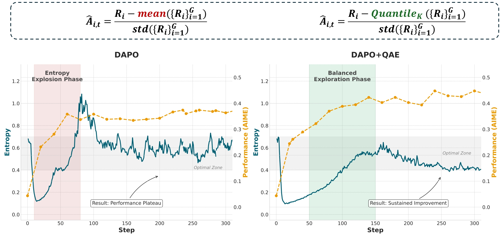
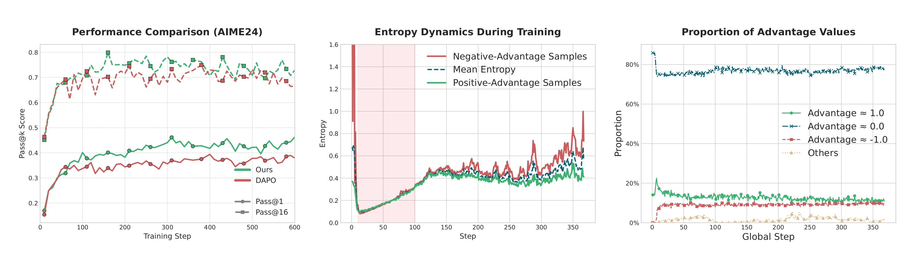
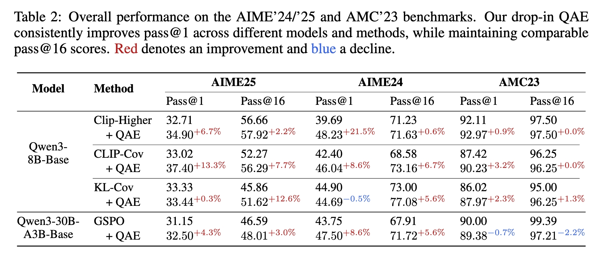

<div align="center">

# Quantile Advantage Estimation (QAE): A One-Line Baseline Swap for Entropy-Safe RL Reasoning

[](./QAE.pdf)
[](https://github.com/junkangwu/QAE)
<!-- [](https://verl.readthedocs.io/en/latest/start/install.html) -->
</div>


<div align="left">
  
</div>


## 🧠 Introduction

**Problem.** In value-free RL for LLM reasoning (e.g., GRPO/DAPO), training often oscillates between **entropy explosion** (over-random updates driven by negative advantages) and **entropy collapse** (premature determinism), hurting scaling.

**Observation.** The **group mean** baseline is brittle under reward outliers: it inflates the baseline and turns many plausible responses into **negative advantage**, amplifying instability.

**Method (QAE).** Replace the mean with a **K-quantile** baseline per query group. This induces a **two-regime gate**:

* **Hard queries** (low success rate): reinforce **rare successes** only.
* **Easy queries** (high success rate): penalize **residual failures** only.

A single (K $\in$ (0,1)) controls how many responses receive **non-zero advantage**, balancing exploration/exploitation and yielding **two-sided entropy safety** under first-order softmax updates.

---

## 🔩 One-Line Core Change

File: `./verl/trainer/ppo/core_algos.py` (lines ~315–319)

```python
quantile_k = config.get("quantile_k", -1.0) if config else -1.0
if 0 < quantile_k < 1:
    id2mean[idx] = torch.quantile(scores_tensor, quantile_k)
else:
    id2mean[idx] = torch.mean(scores_tensor)
```

* If `0 < quantile_k < 1`, the baseline becomes the **K-quantile**; otherwise it **falls back to the mean** (exactly GRPO/DAPO behavior).
* No other algorithmic changes are required.

---


<!-- --- -->

<!-- ## 🎉 News

* **2025-09-26** — Released QAE scripts under `./verl/recipe/qae/` for Qwen3-8B/14B and Qwen2.5-32B.
* **2025-09-26** — Public preprint available at `./docs/ICLR_2026_QAE.pdf`. Core idea: **replace the group mean baseline with a K-quantile baseline** to keep entropy in a productive range and mitigate both **explosion** and **collapse**. -->

<!-- --- -->

## ✨ Getting Started

We **inherit environment setup and quick start** from VERL. Please follow the official docs:

* **Install:** [https://verl.readthedocs.io/en/latest/start/install.html](https://verl.readthedocs.io/en/latest/start/install.html)
* **Quick Start:** [https://verl.readthedocs.io/en/latest/start/quickstart.html](https://verl.readthedocs.io/en/latest/start/quickstart.html)

> **This repo only changes the DAPO recipe** by adding a single argument `quantile_k`. Original DAPO scripts for reference:
> [https://github.com/volcengine/verl/tree/main/recipe/dapo](https://github.com/volcengine/verl/tree/main/recipe/dapo)

---

## ⚙️ Training

We provide three ready-to-run scripts (paths relative to `verl/`):

```
./recipe/qae/run_dapo_qwen2.5_32b.sh
./recipe/qae/run_dapo_qwen3-14b-base.sh
./recipe/qae/run_dapo_qwen3-8b-base.sh
```

### What changed in the scripts?

We **only** pass one extra flag to the DAPO launcher, e.g.:

```diff
- python3 -m recipe.dapo.main_dapo ...
+ python3 -m recipe.dapo.main_dapo ++algorithm.quantile_k=0.4 ...
```

If your launcher loads a YAML config, you can equivalently add:

```yaml
# in your training config
quantile_k: 0.4
```

Both forms are supported—the trainer reads `quantile_k` from the merged config.

---

## 📊 Results & Figures


* **Training dynamics (entropy vs. pass@k):** QAE suppresses the early entropy spike while improving **pass@1**, with **pass@16** comparable to the mean-baseline recipe.
* **Credit assignment sparsity:** ≈**80%** of responses maintain **zero advantage**, concentrating updates on informative samples.
* **Composability:** QAE composes with token-level methods (e.g., **CLIP-COV**, **KL-COV**) and sequence-level **GSPO**, providing **drop-in gains**.

<div align="left">
  
</div>
<div align="left">
  
</div>

---

## 🧪 Hyperparameter Tips (`quantile_k`)

* **Role.** `quantile_k` controls the **fraction of responses with non-zero advantage** per group.

  * Larger `K` → fewer non-zeros → **more exploration** (prevents **collapse**).
  * Smaller `K` → more non-zeros → **more exploitation** (tames **explosion**).

* **Recommended defaults.**

  * Start with **`quantile_k = 0.4`** (stable with DAPO/Clip-Higher).
  * If you observe **early entropy collapse**, increase to **`0.6`**.
  * Tune by **monitoring training entropy** in addition to accuracy; a single-knob adjustment is usually enough.

* **Why sequence-level helps.** Token-level controls (clipping/KL) rescale steps but do **not** change the response-level baseline; QAE fixes the **baseline** itself, which directly regulates the sign/sparsity of advantages.

---

## 🎈 Citation

```bibtex
@article{wu2025qae,
  title   = {Quantile Advantage Estimation for Entropy-Safe Reasoning},
  author  = {Junkang Wu and Kexin Huang and Jiancan Wu and An Zhang and Xiang Wang and Xiangnan He},
  year    = {2025},
  journal = {arXiv preprint},
}
```

---

## 🌻 Acknowledgement

We build on [verl](https://github.com/volcengine/verl) and standard math-reasoning evaluation protocols. QAE is **orthogonal** to token-level regularizers (e.g., [Clip-Cov, KL-Cov](https://arxiv.org/pdf/2505.22617) and **composes** with [GSPO](https://arxiv.org/pdf/2507.18071)).

---

## 📬 Contact

* Junkang Wu — [jkwu0909@gmail.com](mailto:jkwu0909@gmail.com)

